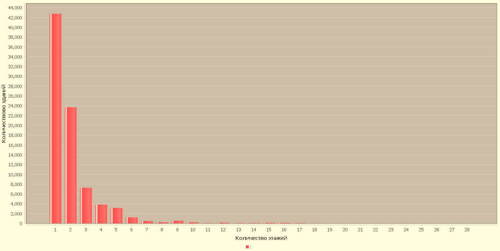
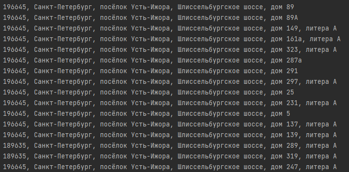
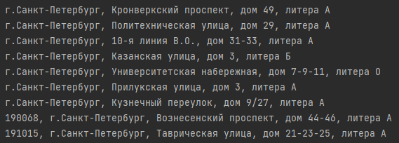
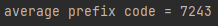

Задание 1) Создаем график количества домов с определенным количеством этажей

Задание 2) Находим зарегестрированные участки, по улице шлиссельбургское шоссе с префиксом 9881

задание 3) Находим "университеты" выше 5 этажа с известным годом постройки

находим средний prefix_code

Последовательность работы по проекту:

1)Создаём базы данных, с методом, с помощью которого создается подключение к базе данных

2)Создаем метод Base, где описываем сущность(number,adress,numberFloor,appelation)

3)Создаем класс TableParser, где обрабатываем функционал парсинга csv файлов в list

4)Создаем класс